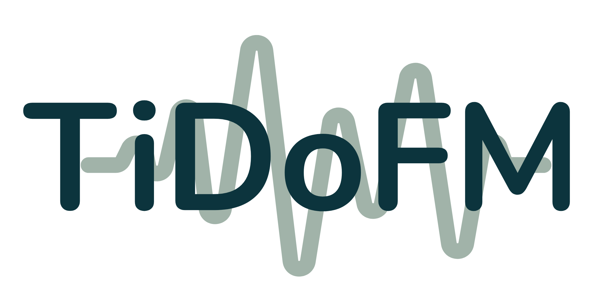

    

<h1 align="center">Time Domain Fisher Matrix Code</h1>

  A package calculating the Antenna Pattern, SNR, and the Fisher Matrix with time domain signals. 

## About

TiDoFM (Time Domain Fisher Matrix Code):

╚══ TiDoFM  
  >══ ./ASD: directory contains sensitivity curves  
  >══ antenna_pattern_class.py: calculate the antenna pattern  
  >══ fm_class.py: calculate the fisher matrix for input time domain signal  
  >══ snr_class.py: calculate the snr for input time domain signals  
  >══ TiDoFM_tutorial.ipynb: tutorial of how to use TiDoFM

## Tutorial

- An example tutorial of how to use TiDoFM is given in [**TiDoFM_tutorial.ipynb**](https://github.com/IrisLi135/TiDoFM/blob/main/TiDoFM_tutorial.ipynb).

- Please click [**https://irisli135.github.io/docs/**](https://irisli135.github.io/docs/) for detailed information of this package.

## Contributors:
- [Ik Siong Heng](mailto:ik.heng@glasgow.ac.uk): Provided guidance and mentorship.
- [Man Leong Chan](mailto:mervync@phas.ubc.ca): Set up the entire codebase, developed the initial functionality, and contributed to the ongoing development of the code.
- [Yufeng Li](mailto:yufengli@bnu.edu.cn): Expanded and optimized the codebase, improving its functionality and performance.

### Please cite the following papers if you publish results based on TiDoFM, Thanks!
1. [Man Leong Chan, Chris Messenger, Ik Siong Heng et al. (2018)](https://journals.aps.org/prd/abstract/10.1103/PhysRevD.97.123014)
2. [Yufeng Li, Ik Siong Heng, Man Leong Chan et al. (2022)](https://journals.aps.org/prd/abstract/10.1103/PhysRevD.105.043010)